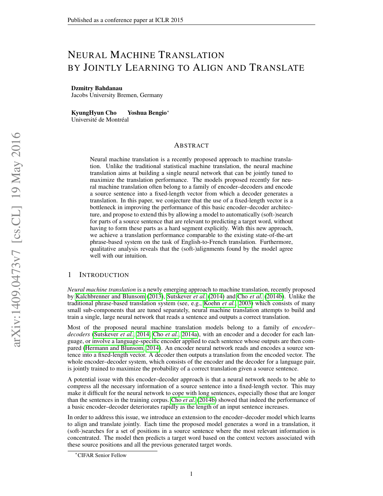
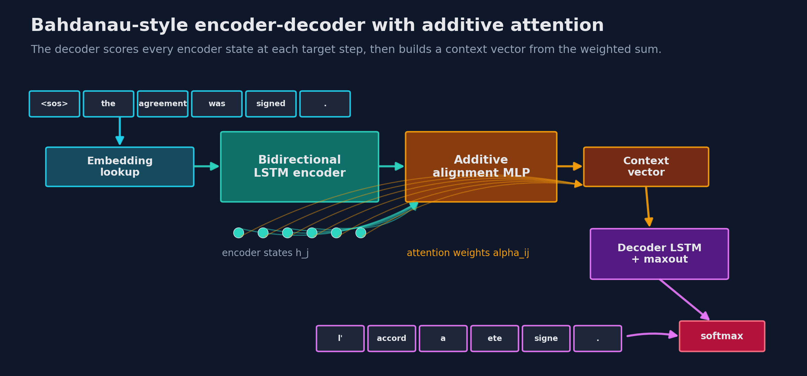
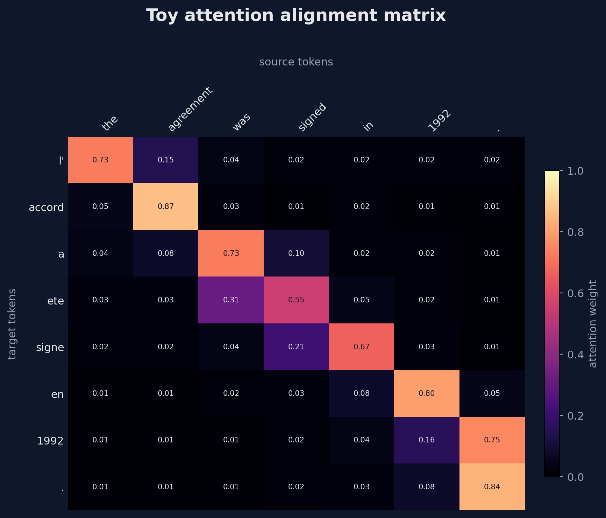
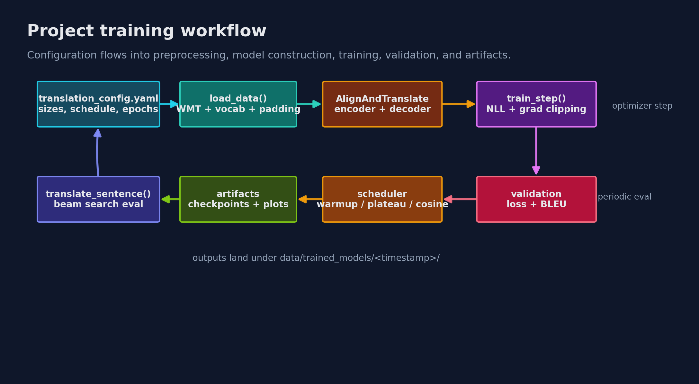

# Bahdanau Neural Machine Translation

<p align="center">
  
</p>

PyTorch implementation of **Neural Machine Translation by Jointly Learning to Align and Translate** by Dzmitry Bahdanau, Kyunghyun Cho, and Yoshua Bengio. The project focuses on English-to-French translation with a bidirectional recurrent encoder, an additive attention decoder, beam-search evaluation, BLEU scoring, and saved attention visualizations.

The original paper is available on arXiv: [arxiv.org/abs/1409.0473](https://arxiv.org/abs/1409.0473). A local copy is also checked in as [article.pdf](article.pdf).

<p align="center">
  <a href="https://arxiv.org/abs/1409.0473">
    
  </a>
</p>

## What This Implements

- Bahdanau-style additive attention over all encoder states at each decoder step.
- Bidirectional LSTM encoder with source reversal, matching the paper's practical setup.
- LSTM decoder with learned target embeddings, context vectors, and maxout output layers.
- WMT14 English/French data loading through Hugging Face `datasets`.
- Moses tokenization, word-frequency vocabularies, fixed-length padding, and local preprocessing caches.
- Training with gradient clipping, optional gradient accumulation, mixed precision on CUDA, checkpointing, scheduler support, BLEU evaluation, greedy decoding, and beam-search decoding.
- Attention plots and sample translations saved during training.

## Model Figures

The architecture figure summarizes the implementation in `src/models`.



This toy alignment matrix shows how target tokens can distribute attention over source tokens. It is explanatory, not a trained checkpoint output.



Training follows a config-driven pipeline from WMT preprocessing to checkpoints, plots, and translations.



Regenerate the deterministic README figures with:

```bash
python3 scripts/generate_readme_assets.py
pdftoppm -png -f 1 -l 1 -singlefile -r 125 article.pdf docs/assets/paper-snapshot
```

The opening banner was generated as a diffusion-style visual asset for this README and saved at `docs/assets/diffusion-attention-hero.png`.

## Repository Layout

```text
.
|-- article.pdf
|-- main.ipynb
|-- run.py
|-- translation_config.yaml
|-- translation_config_smoke.yaml
|-- src
|   |-- data_preprocessing
|   |-- metrics
|   |-- models
|   `-- utils
|-- tests
`-- docs/assets
```

## Installation

Use Python 3.10+ and install the package in editable mode:

```bash
python3 -m venv .venv
source .venv/bin/activate
pip install --upgrade pip
pip install --upgrade -r requirements.txt
pip install --upgrade -e ./src
```

If you prefer conda:

```bash
conda create -n bahdanau-nmt python=3.10 -y
conda activate bahdanau-nmt
pip install --upgrade -r requirements.txt
pip install --upgrade -e ./src
```

Check CUDA availability:

```bash
python3 - <<'PY'
import torch
print(torch.cuda.is_available())
PY
```

## Running

The fastest local confidence check is the synthetic integration test, which does not download WMT data:

```bash
pytest tests/integration/test_pipeline_smoke.py
```

Run the full test suite:

```bash
pytest
```

Run a tiny WMT-backed smoke training job:

```bash
python3 run.py --config_file translation_config_smoke.yaml
```

Run the larger training configuration:

```bash
python3 run.py --config_file translation_config.yaml
```

Evaluate an existing compatible checkpoint with BLEU:

```bash
python3 run.py --config_file translation_config.yaml --test
```

`run.py` chooses CUDA when available and falls back to CPU otherwise.

## Configuration

Most experiment settings live in `translation_config.yaml`:

- `train_len`, `val_len`: number of WMT examples to select.
- `Tx`, `Ty`: fixed source and target sequence lengths.
- `hidden_size`, `embedding_size`, `max_out_units`: model dimensions.
- `vocab_size_en`, `vocab_size_fr`: vocabulary limits.
- `batch_size`, `epochs`, `grad_accum_steps`: training scale.
- `scheduler`: `plateau`, `cosine`, or `none`, with warmup and minimum LR controls.
- `encoder_decoder`: set `true` for the traditional no-attention baseline path.
- `beam_search_eval`: use beam search during evaluation and translation.
- `display_every_epochs`: frequency for sample translations and attention plots.

For quick experiments, copy `translation_config_smoke.yaml` or edit the YAML directly.

## Data And Outputs

The data loader uses:

```python
load_dataset("wmt/wmt14", "fr-en")
```

Generated local artifacts are written under `data/local_data` and are ignored by git:

```text
data/local_data/processed_data/
data/local_data/dictionaries/
data/local_data/trained_models/<timestamp>/
```

Each training run creates subdirectories for checkpoints, best models, text outputs, and attention plots:

```text
checkpoints/
best_models/
outputs/
plots/
```

## Notes

The notebook `main.ipynb` is useful for interactive exploration, while `run.py` is the main reproducible entry point. The code currently targets a word-level NMT setup rather than a modern subword Transformer baseline, which makes it easier to inspect the alignment behavior that made the Bahdanau paper important.
